# Дипломный практикум в Yandex.Cloud
  * [Цели:](#цели)
  * [Этапы выполнения:](#этапы-выполнения)
     * [Создание облачной инфраструктуры](#создание-облачной-инфраструктуры)
     * [Создание Kubernetes кластера](#создание-kubernetes-кластера)
     * [Создание тестового приложения](#создание-тестового-приложения)
     * [Подготовка cистемы мониторинга и деплой приложения](#подготовка-cистемы-мониторинга-и-деплой-приложения)
     * [Установка и настройка CI/CD](#установка-и-настройка-cicd)
  * [Что необходимо для сдачи задания?](#что-необходимо-для-сдачи-задания)
  * [Как правильно задавать вопросы дипломному руководителю?](#как-правильно-задавать-вопросы-дипломному-руководителю)

---
## Цели:

1. Подготовить облачную инфраструктуру на базе облачного провайдера Яндекс.Облако.
2. Запустить и сконфигурировать Kubernetes кластер.
3. Установить и настроить систему мониторинга.
4. Настроить и автоматизировать сборку тестового приложения с использованием Docker-контейнеров.
5. Настроить CI для автоматической сборки и тестирования.
6. Настроить CD для автоматического развёртывания приложения.

---
## Этапы выполнения:


### Создание облачной инфраструктуры

Подготовил облачную инфраструктуру в ЯО при помощи [Terraform](https://www.terraform.io/).

Особенности выполнения:

- Бюджет купона ограничен, что следует иметь в виду при проектировании инфраструктуры и использовании ресурсов;
- Следует использовать последнюю стабильную версию [Terraform](https://www.terraform.io/).

Предварительная подготовка к установке и запуску Kubernetes кластера.

1. Создал сервисный аккаунт, который будет в дальнейшем использоваться Terraform для работы с инфраструктурой с необходимыми и достаточными правами. Не стоит использовать права суперпользователя
2. Подготовил [backend](https://www.terraform.io/docs/language/settings/backends/index.html) для Terraform:
   Выбрал альтернативный вариант: S3 bucket в созданном ЯО аккаунте
3. Настроил [workspaces](https://www.terraform.io/docs/language/state/workspaces.html)  
   Выбрал рекомендуемый вариант: создал два workspace: *stage* и *prod*. Ппоследующие шаги учитывают факт существования нескольких workspace.
4. Создал VPC с подсетями в разных зонах доступности.
   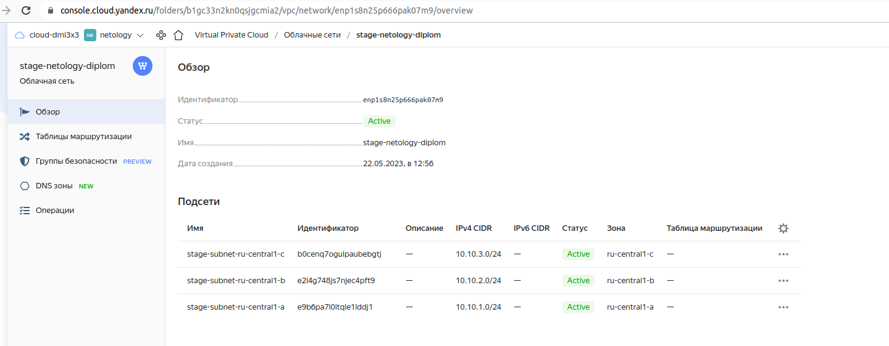
   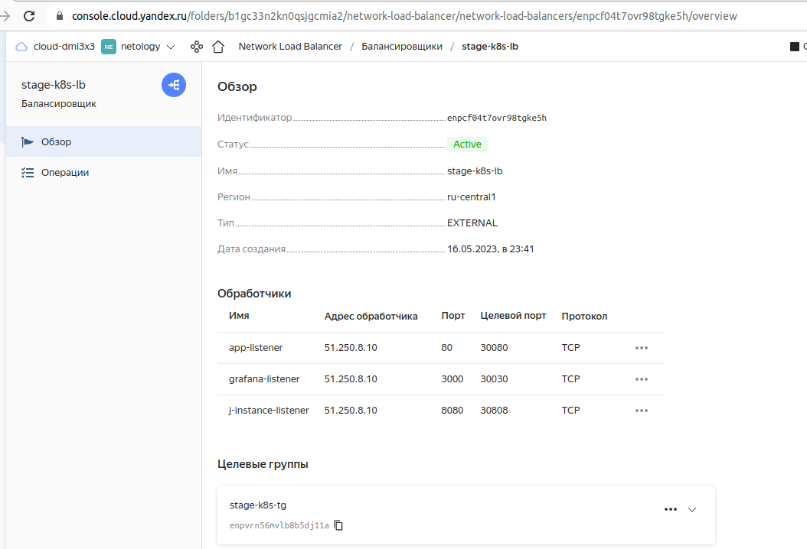
   
   
5. Убедился, что теперь могу выполнить команды `terraform destroy` и `terraform apply` без дополнительных ручных действий.
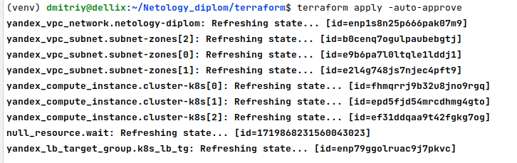
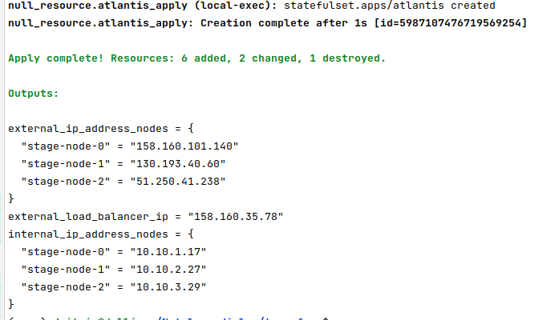
```commandline
(venv) dmitriy@dellix:~/Netology_diplom/terraform$ terraform apply -auto-approve
yandex_vpc_network.netology-diplom: Refreshing state... [id=enp1s8n25p666pak07m9]
yandex_vpc_subnet.subnet-zones[2]: Refreshing state... [id=b0cenq7ogulpaubebgtj]
yandex_vpc_subnet.subnet-zones[0]: Refreshing state... [id=e9b6pa7l0ltqle1lddj1]
yandex_vpc_subnet.subnet-zones[1]: Refreshing state... [id=e2l4g748js7njec4pft9]
yandex_compute_instance.cluster-k8s[0]: Refreshing state... [id=fhmqrrj9b32u8jno9rgq]
yandex_compute_instance.cluster-k8s[1]: Refreshing state... [id=epd5fjd54mrcdhmg4gto]
yandex_compute_instance.cluster-k8s[2]: Refreshing state... [id=ef31ddqaa9t42fgkg7og]
.........
null_resource.atlantis_apply (local-exec): statefulset.apps/atlantis created
null_resource.atlantis_apply: Creation complete after 1s [id=5987107476719569254]

Apply complete! Resources: 6 added, 2 changed, 1 destroyed.

Outputs:

external_ip_address_nodes = {
  "stage-node-0" = "158.160.101.140"
  "stage-node-1" = "130.193.40.60"
  "stage-node-2" = "51.250.41.238"
}
external_load_balancer_ip = "158.160.35.78"
internal_ip_address_nodes = {
  "stage-node-0" = "10.10.1.17"
  "stage-node-1" = "10.10.2.27"
  "stage-node-2" = "10.10.3.29"
}
```

Получил ожидаемые результаты:

1. Terraform сконфигурирован и создание инфраструктуры посредством Terraform возможно без дополнительных ручных действий.
   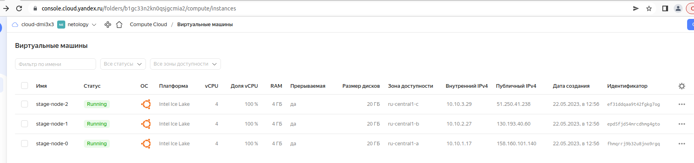
2. Полученная конфигурация инфраструктуры является предварительной, поэтому в ходе дальнейшего выполнения задания возможны изменения.

---
### Создание Kubernetes кластера

Создал [Kubernetes](https://kubernetes.io/ru/docs/concepts/overview/what-is-kubernetes/) кластер на базе предварительно созданной инфраструктуры.  Обеспечил доступ к ресурсам из Интернета.

С помощью рекомендуемого ваианта:

   самостоятельная установка Kubernetes кластера.  
   а. При помощи Terraform подготовить как минимум 3 виртуальных машины Compute Cloud для создания Kubernetes-кластера. Тип виртуальной машины следует выбрать самостоятельно с учётом требовании к производительности и стоимости. Если в дальнейшем поймете, что необходимо сменить тип инстанса, используйте Terraform для внесения изменений.  
   б. Подготовил [ansible](https://www.ansible.com/) [конфигурации](https://raw.githubusercontent.com/dmi3x3/netology_diplom/main/example_stage-inventory), воспользовался, [Kubespray](https://kubernetes.io/docs/setup/production-environment/tools/kubespray/)  
   в. Задеплоил Kubernetes на подготовленные ранее инстансы, в случае нехватки каких-либо ресурсов вы всегда можете создать их при помощи Terraform.
  
Получил ожидаемый результат:

1. Работоспособный Kubernetes кластер.


<details>
<summary>Kubernetes кластер</summary>

```commandline
(venv) dmitriy@dellix:~/Netology_diplom/terraform$ kubectl get all --all-namespaces
NAMESPACE     NAME                                            READY   STATUS     RESTARTS        AGE
atlantis      pod/atlantis-0                                  1/1     Running    0               3m49s
jenkins       pod/jenkins-j-instance                          1/1     Running    0               19m
jenkins       pod/jenkins-operator-6bd8bdf7fd-t8z6s           1/1     Running    0               3h51m
jenkins       pod/seed-job-agent-j-instance-bcbdc5687-v5xbl   1/1     Running    0               16m
kube-system   pod/calico-kube-controllers-6dfcdfb99-94gw4     1/1     Running    0               3h54m
kube-system   pod/calico-node-7jgf4                           1/1     Running    0               3h55m
kube-system   pod/calico-node-dgrcc                           1/1     Running    0               3h55m
kube-system   pod/calico-node-q4gq6                           1/1     Running    0               3h55m
kube-system   pod/coredns-645b46f4b6-cgkbt                    1/1     Running    0               3h53m
kube-system   pod/coredns-645b46f4b6-lhc2z                    1/1     Running    0               3h53m
kube-system   pod/dns-autoscaler-659b8c48cb-jzbm9             1/1     Running    0               3h53m
kube-system   pod/kube-apiserver-stage-node-0                 1/1     Running    1               3h56m
kube-system   pod/kube-controller-manager-stage-node-0        1/1     Running    2               3h56m
kube-system   pod/kube-proxy-5zrm4                            1/1     Running    0               3h55m
kube-system   pod/kube-proxy-cmp6l                            1/1     Running    0               3h55m
kube-system   pod/kube-proxy-v7xgh                            1/1     Running    0               3h55m
kube-system   pod/kube-scheduler-stage-node-0                 1/1     Running    1               3h56m
kube-system   pod/nginx-proxy-stage-node-1                    1/1     Running    0               3h54m
kube-system   pod/nginx-proxy-stage-node-2                    1/1     Running    0               3h54m
kube-system   pod/nodelocaldns-5mzt8                          1/1     Running    0               3h53m
kube-system   pod/nodelocaldns-bnxvf                          1/1     Running    0               3h53m
kube-system   pod/nodelocaldns-z62c5                          1/1     Running    0               3h53m
monitoring    pod/alertmanager-main-0                         2/2     Running    1 (3h51m ago)   3h52m
monitoring    pod/alertmanager-main-1                         2/2     Running    0               3h52m
monitoring    pod/alertmanager-main-2                         2/2     Running    1 (3h51m ago)   3h52m
monitoring    pod/blackbox-exporter-6495c95d8f-6gp8v          3/3     Running    0               3h52m
monitoring    pod/grafana-68598fdf49-wgbz5                    1/1     Running    0               3h52m
monitoring    pod/kube-state-metrics-7cc68994c-mt7d2          3/3     Running    0               3h52m
monitoring    pod/node-exporter-2bz64                         2/2     Running    0               3h52m
monitoring    pod/node-exporter-c46h5                         2/2     Running    0               3h52m
monitoring    pod/node-exporter-klbvq                         2/2     Running    0               3h52m
monitoring    pod/prometheus-adapter-779df64887-blvtp         1/1     Running    0               3h52m
monitoring    pod/prometheus-adapter-779df64887-kd2g9         1/1     Running    0               3h52m
monitoring    pod/prometheus-k8s-0                            2/2     Running    0               3h52m
monitoring    pod/prometheus-k8s-1                            2/2     Running    0               3h52m
monitoring    pod/prometheus-operator-8d5b96fc9-gq7wj         2/2     Running    0               3h52m
stage         pod/app-web-app-web-repo-6f95967898-pkcck       1/1     Running    0               3h52m

NAMESPACE     NAME                                        TYPE        CLUSTER-IP      EXTERNAL-IP   PORT(S)                        AGE
atlantis      service/atlantis                            ClusterIP   10.233.49.148   <none>        4141/TCP                       3m50s
atlantis      service/atlantis-public                     NodePort    10.233.47.124   <none>        4141:30141/TCP                 3m49s
default       service/kubernetes                          ClusterIP   10.233.0.1      <none>        443/TCP                        3h56m
jenkins       service/jenkins-operator-http-j-instance    NodePort    10.233.63.104   <none>        8080:30808/TCP                 21m
jenkins       service/jenkins-operator-slave-j-instance   ClusterIP   10.233.1.194    <none>        50000/TCP                      21m
kube-system   service/coredns                             ClusterIP   10.233.0.3      <none>        53/UDP,53/TCP,9153/TCP         3h53m
kube-system   service/kubelet                             ClusterIP   None            <none>        10250/TCP,10255/TCP,4194/TCP   3h52m
monitoring    service/alertmanager-main                   ClusterIP   10.233.32.200   <none>        9093/TCP,8080/TCP              3h53m
monitoring    service/alertmanager-operated               ClusterIP   None            <none>        9093/TCP,9094/TCP,9094/UDP     3h52m
monitoring    service/blackbox-exporter                   ClusterIP   10.233.23.23    <none>        9115/TCP,19115/TCP             3h53m
monitoring    service/grafana                             NodePort    10.233.39.159   <none>        3000:30030/TCP                 3h53m
monitoring    service/kube-state-metrics                  ClusterIP   None            <none>        8443/TCP,9443/TCP              3h53m
monitoring    service/node-exporter                       ClusterIP   None            <none>        9100/TCP                       3h53m
monitoring    service/prometheus-adapter                  ClusterIP   10.233.1.203    <none>        443/TCP                        3h53m
monitoring    service/prometheus-k8s                      ClusterIP   10.233.60.145   <none>        9090/TCP,8080/TCP              3h53m
monitoring    service/prometheus-operated                 ClusterIP   None            <none>        9090/TCP                       3h52m
monitoring    service/prometheus-operator                 ClusterIP   None            <none>        8443/TCP                       3h53m
stage         service/app-web-app-web-repo                NodePort    10.233.58.34    <none>        80:30080/TCP                   3h52m

NAMESPACE     NAME                           DESIRED   CURRENT   READY   UP-TO-DATE   AVAILABLE   NODE SELECTOR            AGE
kube-system   daemonset.apps/calico-node     3         3         3       3            3           kubernetes.io/os=linux   3h55m
kube-system   daemonset.apps/kube-proxy      3         3         3       3            3           kubernetes.io/os=linux   3h56m
kube-system   daemonset.apps/nodelocaldns    3         3         3       3            3           kubernetes.io/os=linux   3h53m
monitoring    daemonset.apps/node-exporter   3         3         3       3            3           kubernetes.io/os=linux   3h53m

NAMESPACE     NAME                                        READY   UP-TO-DATE   AVAILABLE   AGE
jenkins       deployment.apps/jenkins-operator            1/1     1            1           3h51m
jenkins       deployment.apps/seed-job-agent-j-instance   1/1     1            1           16m
kube-system   deployment.apps/calico-kube-controllers     1/1     1            1           3h54m
kube-system   deployment.apps/coredns                     2/2     2            2           3h53m
kube-system   deployment.apps/dns-autoscaler              1/1     1            1           3h53m
monitoring    deployment.apps/blackbox-exporter           1/1     1            1           3h53m
monitoring    deployment.apps/grafana                     1/1     1            1           3h53m
monitoring    deployment.apps/kube-state-metrics          1/1     1            1           3h53m
monitoring    deployment.apps/prometheus-adapter          2/2     2            2           3h53m
monitoring    deployment.apps/prometheus-operator         1/1     1            1           3h53m
stage         deployment.apps/app-web-app-web-repo        1/1     1            1           3h52m

NAMESPACE     NAME                                                  DESIRED   CURRENT   READY   AGE
jenkins       replicaset.apps/jenkins-operator-6bd8bdf7fd           1         1         1       3h51m
jenkins       replicaset.apps/seed-job-agent-j-instance-bcbdc5687   1         1         1       16m
kube-system   replicaset.apps/calico-kube-controllers-6dfcdfb99     1         1         1       3h54m
kube-system   replicaset.apps/coredns-645b46f4b6                    2         2         2       3h53m
kube-system   replicaset.apps/dns-autoscaler-659b8c48cb             1         1         1       3h53m
monitoring    replicaset.apps/blackbox-exporter-6495c95d8f          1         1         1       3h52m
monitoring    replicaset.apps/grafana-68598fdf49                    1         1         1       3h52m
monitoring    replicaset.apps/kube-state-metrics-7cc68994c          1         1         1       3h52m
monitoring    replicaset.apps/prometheus-adapter-779df64887         2         2         2       3h52m
monitoring    replicaset.apps/prometheus-operator-8d5b96fc9         1         1         1       3h52m
stage         replicaset.apps/app-web-app-web-repo-6f95967898       1         1         1       3h52m

NAMESPACE    NAME                                 READY   AGE
atlantis     statefulset.apps/atlantis            0/1     3m49s
monitoring   statefulset.apps/alertmanager-main   3/3     3h52m
monitoring   statefulset.apps/prometheus-k8s      2/2     3h52m
```

</details>

2. В файле `~/.kube/config` находятся данные для доступа к кластеру.
Для удобства данные для доступа к кластеру сохранил в файл /home/dmitriy/kubectl-yc-config-dipl-stage, а работу команда kubectl обеспечил с помощью переменной окружения KUBECONFIG.

3. Команда `kubectl get pods --all-namespaces` отрабатывает без ошибок.

<details>
<summary>Вывод на консоль</summary>

```commandline
(venv) dmitriy@dellix:~/Netology_diplom/terraform$ kubectl get pods --all-namespaces
NAMESPACE     NAME                                        READY   STATUS     RESTARTS        AGE
atlantis      atlantis-0                                  1/1     Running    0               3h54m
jenkins       jenkins-j-instance                          1/1     Running    0               22m
jenkins       jenkins-operator-6bd8bdf7fd-t8z6s           1/1     Running    0               3h54m
jenkins       seed-job-agent-j-instance-bcbdc5687-v5xbl   1/1     Running    0               19m
kube-system   calico-kube-controllers-6dfcdfb99-94gw4     1/1     Running    0               3h57m
kube-system   calico-node-7jgf4                           1/1     Running    0               3h57m
kube-system   calico-node-dgrcc                           1/1     Running    0               3h57m
kube-system   calico-node-q4gq6                           1/1     Running    0               3h57m
kube-system   coredns-645b46f4b6-cgkbt                    1/1     Running    0               3h56m
kube-system   coredns-645b46f4b6-lhc2z                    1/1     Running    0               3h56m
kube-system   dns-autoscaler-659b8c48cb-jzbm9             1/1     Running    0               3h56m
kube-system   kube-apiserver-stage-node-0                 1/1     Running    1               3h59m
kube-system   kube-controller-manager-stage-node-0        1/1     Running    2               3h59m
kube-system   kube-proxy-5zrm4                            1/1     Running    0               3h58m
kube-system   kube-proxy-cmp6l                            1/1     Running    0               3h58m
kube-system   kube-proxy-v7xgh                            1/1     Running    0               3h58m
kube-system   kube-scheduler-stage-node-0                 1/1     Running    1               3h59m
kube-system   nginx-proxy-stage-node-1                    1/1     Running    0               3h57m
kube-system   nginx-proxy-stage-node-2                    1/1     Running    0               3h57m
kube-system   nodelocaldns-5mzt8                          1/1     Running    0               3h56m
kube-system   nodelocaldns-bnxvf                          1/1     Running    0               3h56m
kube-system   nodelocaldns-z62c5                          1/1     Running    0               3h56m
monitoring    alertmanager-main-0                         2/2     Running    1 (3h54m ago)   3h55m
monitoring    alertmanager-main-1                         2/2     Running    0               3h55m
monitoring    alertmanager-main-2                         2/2     Running    1 (3h54m ago)   3h55m
monitoring    blackbox-exporter-6495c95d8f-6gp8v          3/3     Running    0               3h55m
monitoring    grafana-68598fdf49-wgbz5                    1/1     Running    0               3h55m
monitoring    kube-state-metrics-7cc68994c-mt7d2          3/3     Running    0               3h55m
monitoring    node-exporter-2bz64                         2/2     Running    0               3h55m
monitoring    node-exporter-c46h5                         2/2     Running    0               3h55m
monitoring    node-exporter-klbvq                         2/2     Running    0               3h55m
monitoring    prometheus-adapter-779df64887-blvtp         1/1     Running    0               3h55m
monitoring    prometheus-adapter-779df64887-kd2g9         1/1     Running    0               3h55m
monitoring    prometheus-k8s-0                            2/2     Running    0               3h55m
monitoring    prometheus-k8s-1                            2/2     Running    0               3h55m
monitoring    prometheus-operator-8d5b96fc9-gq7wj         2/2     Running    0               3h55m
stage         app-web-app-web-repo-6f95967898-pkcck       1/1     Running    0               3h55m
```

</details>

---
### Создание тестового приложения

Подготовил тестовое приложение, эмулирующее основное приложение разрабатываемое моей компанией.

Способ подготовки:

Выбрал рекомендуемый вариант:  
   а. Создал отдельный [git репозиторий](https://github.com/dmi3x3/app_web) с простым nginx конфигом, который будет отдавать статические данные.  
   б. Подготовил [Dockerfile](https://github.com/dmi3x3/app_web/blob/main/Dockerfile) для создания образа приложения.

Получил ожидаемый результат:

1. [Git репозиторий](https://github.com/dmi3x3/app_web) с тестовым приложением и [Dockerfile](https://github.com/dmi3x3/app_web/blob/main/Dockerfile) для создания образа приложения.
2. [Регистр с собранным docker image](https://hub.docker.com/r/dmi3x3/app_web/tags). В качестве регистра использовал DockerHub.

---
### Подготовка cистемы мониторинга и деплой приложения
 
Подготовил файлы для настройки Kubernetes кластера.
 
1. Задеплоил в кластер [prometheus](https://prometheus.io/), [grafana](https://grafana.com/), [alertmanager](https://github.com/prometheus/alertmanager), [экспортер](https://github.com/prometheus/node_exporter) основных метрик Kubernetes.
   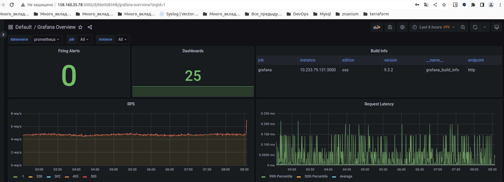
   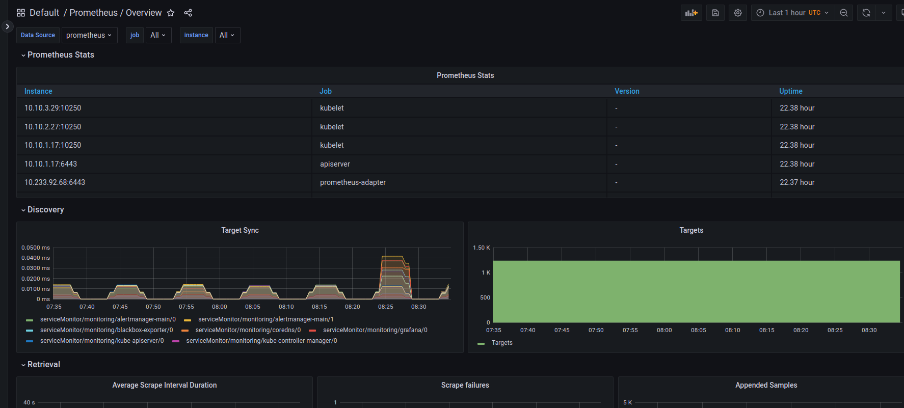
2. Задеплоил тестовое приложение, [nginx](https://www.nginx.com/) сервер отдающий статическую страницу.
   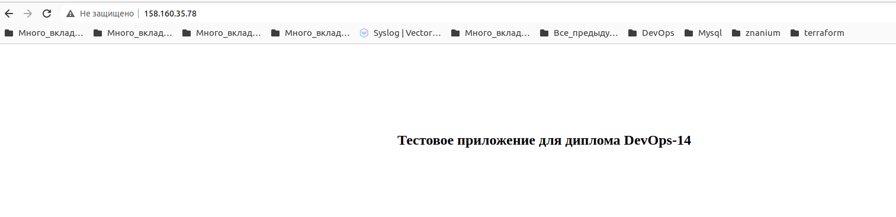
Выбрал рекомендуемый способ выполнения:
1. Воспользовался пакетом [kube-prometheus](https://github.com/prometheus-operator/kube-prometheus), который уже включает в себя [Kubernetes оператор](https://operatorhub.io/) для [grafana](https://grafana.com/), [prometheus](https://prometheus.io/), [alertmanager](https://github.com/prometheus/alertmanager) и [node_exporter](https://github.com/prometheus/node_exporter). При желании можете собрать все эти приложения отдельно.
2. В работе мониторинга используется конфигурация по-умолчанию.
3. Т.к. на первом этапе я не воспользовался [Terraform Cloud](https://app.terraform.io/), то задеплоил в кластер [atlantis](https://www.runatlantis.io/) для отслеживания изменений инфраструктуры.
   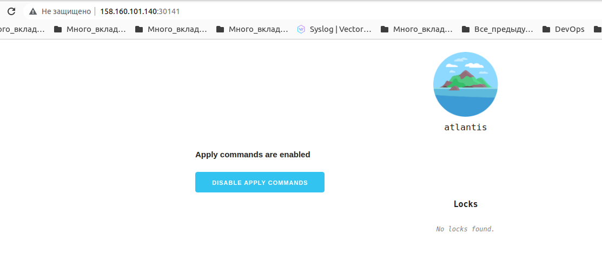

Ожидаемый результат:
1. [Git репозиторий с конфигурационными файлами для настройки Kubernetes](https://github.com/dmi3x3/netology_diplom).
2. Http доступ к web интерфейсу grafana.
   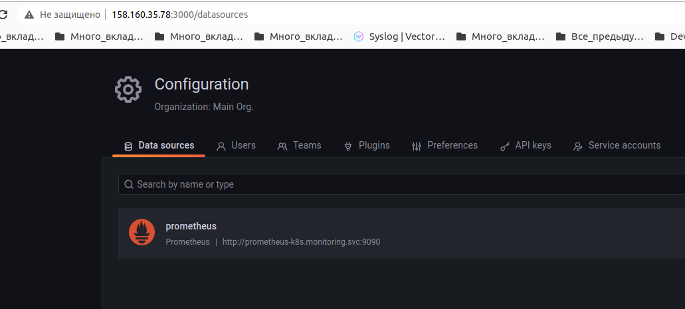
3. Дашборды в grafana отображающие состояние Kubernetes кластера.
   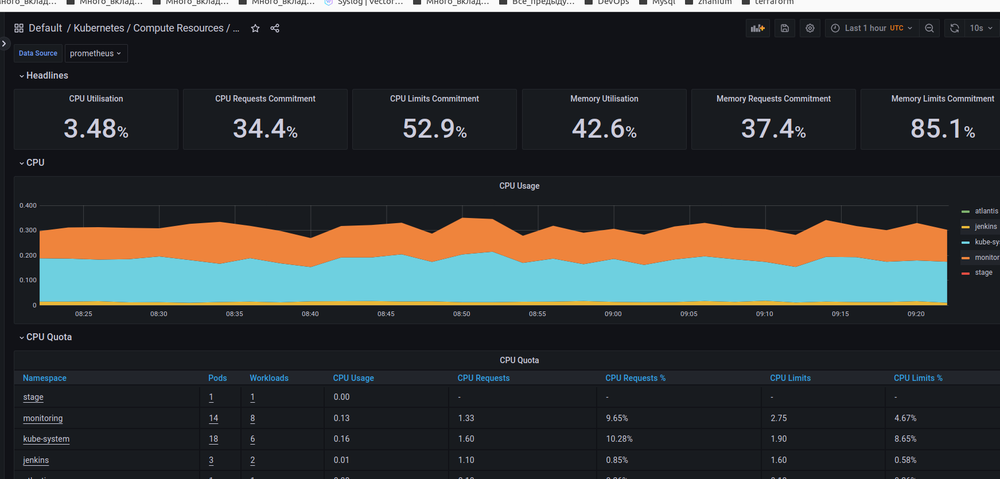
   
4. Http доступ к тестовому приложению.
   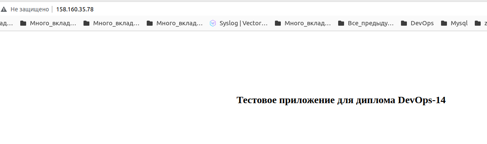

---
### Установка и настройка CI/CD

Настроил ci/cd систему для автоматической сборки docker image и деплоя приложения при изменении кода.

Цель:

1. Автоматическая сборка docker образа при коммите в репозиторий с тестовым приложением.
2. Автоматический деплой нового docker образа.

Использовал нативный kubernetes оператор [jenkins-operator](https://jenkinsci.github.io/kubernetes-operator/docs/)

Ожидаемый результат:

1. Интерфейс ci/cd сервиса доступен по http.
   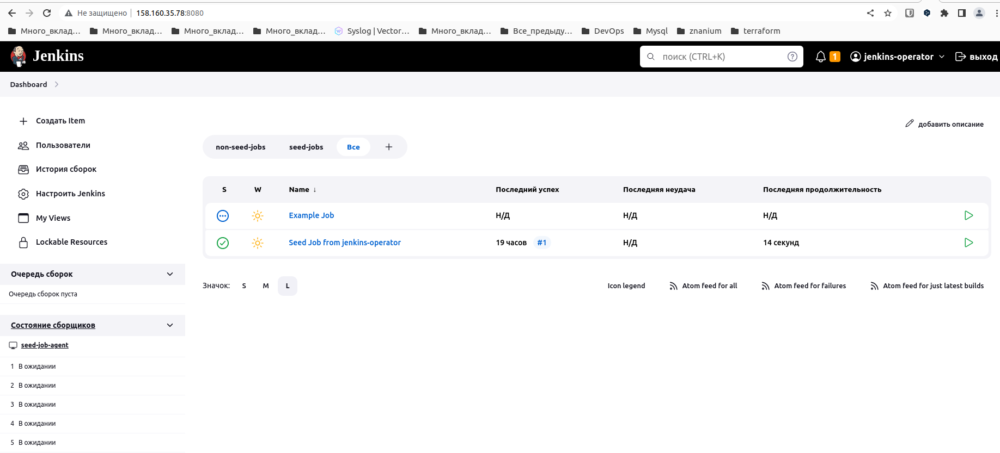
2. При любом коммите в репозиторие с тестовым приложением происходит сборка и отправка в регистр Docker образа.

```commandline
(venv) dmitriy@dellix:~/Netology_diplom/terraform/app_web$ git add Dockerfile && git commit -m "fix --type=kubernetes.io/dockerconfigjson file 143" && git push
[main 2b9304f] fix --type=kubernetes.io/dockerconfigjson file 143
 1 file changed, 1 insertion(+), 1 deletion(-)
Перечисление объектов: 5, готово.
Подсчет объектов: 100% (5/5), готово.
При сжатии изменений используется до 12 потоков
Сжатие объектов: 100% (3/3), готово.
Запись объектов: 100% (3/3), 335 байтов | 18.00 КиБ/с, готово.
Всего 3 (изменений 2), повторно использовано 0 (изменений 0), повторно использовано пакетов 0
remote: Resolving deltas: 100% (2/2), completed with 2 local objects.
To github.com:dmi3x3/app_web.git
   b305576..2b9304f  main -> main
```

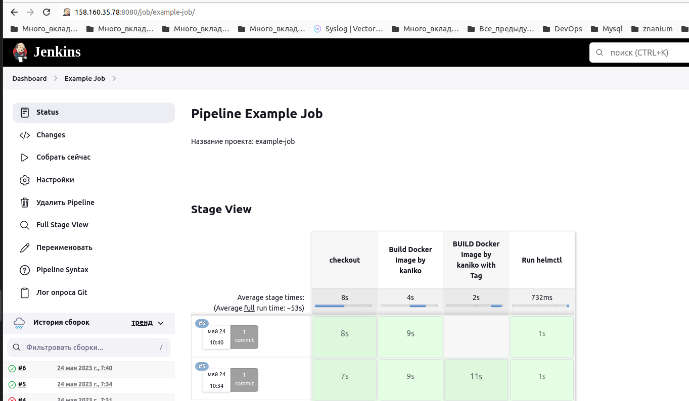 

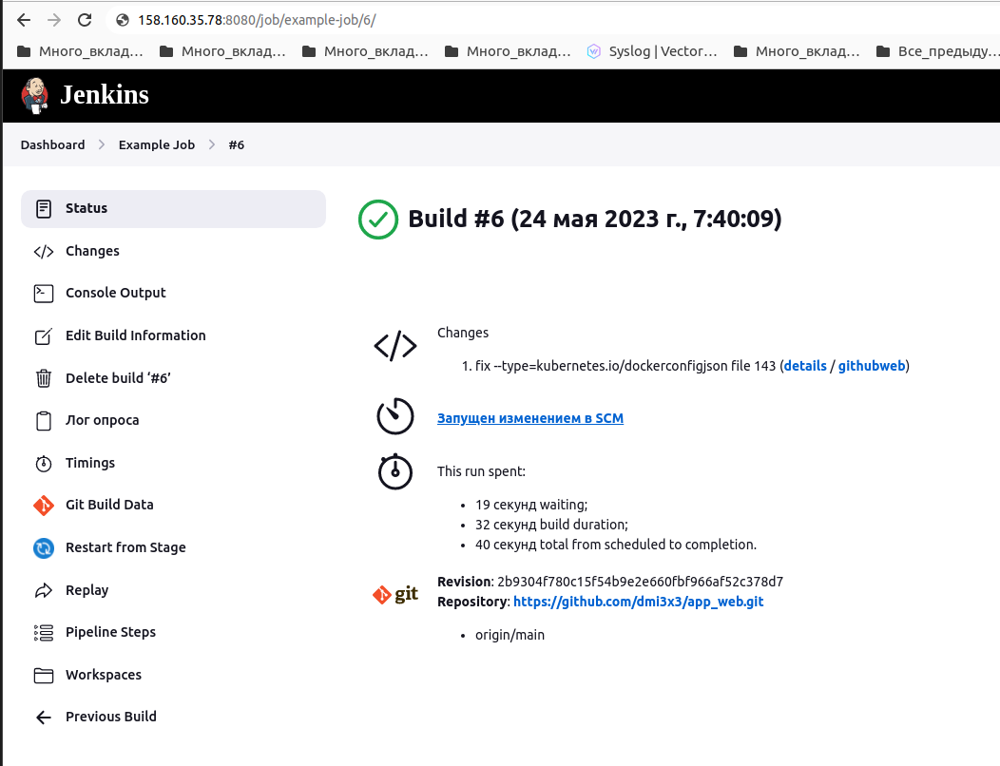


<details>
<summary>Вывод на консоль</summary>

```commandline
Started by an SCM change
Checking out git https://github.com/dmi3x3/app_web.git into /var/lib/jenkins/workspace/example-job@script/979245040ed156c1d70f08ff53b0ee0a6cd1e69733169d8be8a1a569ee38086f to read cicd/pipelines/build.jenkins
The recommended git tool is: NONE
No credentials specified
 > git rev-parse --resolve-git-dir /var/lib/jenkins/workspace/example-job@script/979245040ed156c1d70f08ff53b0ee0a6cd1e69733169d8be8a1a569ee38086f/.git # timeout=10
Fetching changes from the remote Git repository
 > git config remote.origin.url https://github.com/dmi3x3/app_web.git # timeout=10
Fetching upstream changes from https://github.com/dmi3x3/app_web.git
 > git --version # timeout=10
 > git --version # 'git version 2.30.2'
 > git fetch --tags --force --progress -- https://github.com/dmi3x3/app_web.git +refs/heads/*:refs/remotes/origin/* # timeout=10
Seen branch in repository origin/main
Seen 1 remote branch
 > git show-ref --tags -d # timeout=10
Checking out Revision 2b9304f780c15f54b9e2e660fbf966af52c378d7 (origin/main)
 > git config core.sparsecheckout # timeout=10
 > git checkout -f 2b9304f780c15f54b9e2e660fbf966af52c378d7 # timeout=10
Commit message: "fix --type=kubernetes.io/dockerconfigjson file 143"
 > git rev-list --no-walk b3055764e155cd7ad25171a35c8ded960274cd47 # timeout=10
[Pipeline] Start of Pipeline
[Pipeline] podTemplate
[Pipeline] {
[Pipeline] node
Created Pod: kubernetes jenkins/example-job-6-n9lsq-1q2br-xn314
Agent example-job-6-n9lsq-1q2br-xn314 is provisioned from template example-job_6-n9lsq-1q2br
---
apiVersion: "v1"
kind: "Pod"
metadata:
  annotations:
    buildUrl: "http://jenkins-operator-http-j-instance.jenkins.svc.cluster.local:8080/job/example-job/6/"
    runUrl: "job/example-job/6/"
  labels:
    job: "build-service"
    jenkins: "slave"
    jenkins/label-digest: "edf0a182ab8596428e0473d8f3646c79e8cc8afc"
    jenkins/label: "example-job_6-n9lsq"
  name: "example-job-6-n9lsq-1q2br-xn314"
  namespace: "jenkins"
spec:
  containers:
  - command:
    - "cat"
    image: "gcr.io/kaniko-project/executor:debug"
    name: "kaniko"
    tty: true
    volumeMounts:
    - mountPath: "/kaniko/.docker/"
      name: "docker-config"
    - mountPath: "/home/jenkins/agent"
      name: "workspace-volume"
      readOnly: false
  - command:
    - "cat"
    image: "dmi3x3/helmctl:1.0.0"
    name: "helmctl"
    tty: true
    volumeMounts:
    - mountPath: "/home/jenkins/agent"
      name: "workspace-volume"
      readOnly: false
  - env:
    - name: "JENKINS_SECRET"
      value: "********"
    - name: "JENKINS_TUNNEL"
      value: "jenkins-operator-slave-j-instance.jenkins.svc.cluster.local:50000"
    - name: "JENKINS_AGENT_NAME"
      value: "example-job-6-n9lsq-1q2br-xn314"
    - name: "JENKINS_NAME"
      value: "example-job-6-n9lsq-1q2br-xn314"
    - name: "JENKINS_AGENT_WORKDIR"
      value: "/home/jenkins/agent"
    - name: "JENKINS_URL"
      value: "http://jenkins-operator-http-j-instance.jenkins.svc.cluster.local:8080/"
    image: "jenkins/inbound-agent:3107.v665000b_51092-5"
    name: "jnlp"
    resources:
      requests:
        memory: "256Mi"
        cpu: "100m"
    volumeMounts:
    - mountPath: "/home/jenkins/agent"
      name: "workspace-volume"
      readOnly: false
  nodeSelector:
    kubernetes.io/os: "linux"
  restartPolicy: "Never"
  serviceAccountName: "deploy-stage1"
  volumes:
  - hostPath:
      path: "/var/run/docker.sock"
    name: "docker-sock"
  - name: "docker-config"
    secret:
      items:
      - key: ".dockerconfigjson"
        path: "config.json"
      secretName: "dockercred"
  - emptyDir:
      medium: ""
    name: "workspace-volume"

Running on example-job-6-n9lsq-1q2br-xn314 in /home/jenkins/agent/workspace/example-job
[Pipeline] {
[Pipeline] withEnv
[Pipeline] {
[Pipeline] timestamps
[Pipeline] {
[Pipeline] stage
[Pipeline] { (checkout)
[Pipeline] script
[Pipeline] {
[Pipeline] checkout
10:40:22  The recommended git tool is: NONE
10:40:25  No credentials specified
10:40:25  Cloning the remote Git repository
10:40:25  Cloning repository https://github.com/dmi3x3/app_web.git
10:40:26   > git init /home/jenkins/agent/workspace/example-job # timeout=10
10:40:26  Fetching upstream changes from https://github.com/dmi3x3/app_web.git
10:40:26   > git --version # timeout=10
10:40:26   > git --version # 'git version 2.30.2'
10:40:26   > git fetch --tags --force --progress -- https://github.com/dmi3x3/app_web.git +refs/heads/*:refs/remotes/origin/* # timeout=10
10:40:26   > git config remote.origin.url https://github.com/dmi3x3/app_web.git # timeout=10
10:40:26   > git config --add remote.origin.fetch +refs/heads/*:refs/remotes/origin/* # timeout=10
10:40:27  Avoid second fetch
10:40:28  Checking out Revision 2b9304f780c15f54b9e2e660fbf966af52c378d7 (origin/main)
10:40:28  Commit message: "fix --type=kubernetes.io/dockerconfigjson file 143"
[Pipeline] sh
10:40:27  Seen branch in repository origin/main
10:40:27  Seen 1 remote branch
10:40:27   > git show-ref --tags -d # timeout=10
10:40:28   > git config core.sparsecheckout # timeout=10
10:40:28   > git checkout -f 2b9304f780c15f54b9e2e660fbf966af52c378d7 # timeout=10
10:40:29  + git log -1 --format=%h.%ad --date=format:%Y%m%d-%H%M
10:40:29  + cat
[Pipeline] sh
10:40:29  + git --no-pager tag --points-at HEAD
[Pipeline] echo
10:40:29  checking version tag 
[Pipeline] echo
10:40:29  tag null
[Pipeline] sh
10:40:30  + git --no-pager tag --points-at HEAD
[Pipeline] sh
10:40:30  + echo Building revision: 6-2b9304f.20230524-1039 build_tag:  gt: false
10:40:30  Building revision: 6-2b9304f.20230524-1039 build_tag:  gt: false
[Pipeline] }
[Pipeline] // script
[Pipeline] }
[Pipeline] // stage
[Pipeline] stage
[Pipeline] { (Build Docker Image by kaniko)
[Pipeline] container
[Pipeline] {
[Pipeline] sh
10:40:31  + pwd
10:40:31  + /kaniko/executor --dockerfile Dockerfile --context /home/jenkins/agent/workspace/example-job/ --verbosity debug --insecure --skip-tls-verify --destination dmi3x3/app_web:6-2b9304f.20230524-1039
10:40:31  DEBU[0000] Copying file /home/jenkins/agent/workspace/example-job/Dockerfile to /kaniko/Dockerfile 
10:40:32  DEBU[0001] Skip resolving path /kaniko/Dockerfile       
10:40:32  DEBU[0001] Skip resolving path /home/jenkins/agent/workspace/example-job/ 
10:40:32  DEBU[0001] Skip resolving path /cache                   
10:40:32  DEBU[0001] Skip resolving path                          
10:40:32  DEBU[0001] Skip resolving path                          
10:40:32  DEBU[0001] Skip resolving path                          
10:40:32  DEBU[0001] Skip resolving path                          
10:40:32  DEBU[0001] Built stage name to index map: map[]         
10:40:32  INFO[0001] Retrieving image manifest nginx:1.23.3       
10:40:32  INFO[0001] Retrieving image nginx:1.23.3 from registry index.docker.io 
10:40:34  INFO[0002] Built cross stage deps: map[]                
10:40:34  INFO[0002] Retrieving image manifest nginx:1.23.3       
10:40:34  INFO[0002] Returning cached image manifest              
10:40:34  INFO[0002] Executing 0 build triggers                   
10:40:34  INFO[0002] Building stage 'nginx:1.23.3' [idx: '0', base-idx: '-1'] 
10:40:34  INFO[0002] Unpacking rootfs as cmd ADD conf /etc/nginx requires it. 
10:40:34  DEBU[0002] Ignore list: [{/kaniko false} {/etc/mtab false} {/tmp/apt-key-gpghome true} {/var/run false} {/proc false} {/dev false} {/dev/pts false} {/dev/mqueue false} {/sys false} {/sys/fs/cgroup false} {/sys/fs/cgroup/systemd false} {/sys/fs/cgroup/net_cls,net_prio false} {/sys/fs/cgroup/cpu,cpuacct false} {/sys/fs/cgroup/rdma false} {/sys/fs/cgroup/freezer false} {/sys/fs/cgroup/blkio false} {/sys/fs/cgroup/memory false} {/sys/fs/cgroup/pids false} {/sys/fs/cgroup/cpuset false} {/sys/fs/cgroup/devices false} {/sys/fs/cgroup/perf_event false} {/sys/fs/cgroup/hugetlb false} {/busybox false} {/kaniko/.docker false} {/etc/hosts false} {/dev/termination-log false} {/etc/hostname false} {/etc/resolv.conf false} {/dev/shm false} {/home/jenkins/agent false} {/var/run/secrets/kubernetes.io/serviceaccount false} {/dev/console false} {/proc/bus false} {/proc/fs false} {/proc/irq false} {/proc/sys false} {/proc/sysrq-trigger false} {/proc/acpi false} {/proc/kcore false} {/proc/keys false} {/proc/timer_list false} {/proc/sched_debug false} {/proc/scsi false} {/sys/firmware false}] 
10:40:34  DEBU[0002] Not adding /dev because it is ignored        
10:40:34  DEBU[0002] Not adding /etc/hostname because it is ignored 
10:40:34  DEBU[0002] Not adding /etc/resolv.conf because it is ignored 
10:40:34  DEBU[0002] Not adding /proc because it is ignored       
10:40:34  DEBU[0002] Not adding /sys because it is ignored        
10:40:35  DEBU[0003] Not adding /var/run because it is ignored    
10:40:37  DEBU[0005] Resolved conf to conf                        
10:40:37  DEBU[0005] Resolved /etc/nginx to /etc/nginx            
10:40:37  INFO[0005] Using files from context: [/home/jenkins/agent/workspace/example-job/conf] 
10:40:37  INFO[0005] ADD conf /etc/nginx                          
10:40:37  DEBU[0005] Resolved conf to conf                        
10:40:37  DEBU[0005] Resolved /etc/nginx to /etc/nginx            
10:40:37  DEBU[0005] found uid -1 and gid -1 for chown string     
10:40:37  DEBU[0005] Resolved conf to conf                        
10:40:37  DEBU[0005] Resolved /etc/nginx to /etc/nginx            
10:40:37  DEBU[0005] Getting files and contents at root /home/jenkins/agent/workspace/example-job/conf/ for /home/jenkins/agent/workspace/example-job/conf 
10:40:37  DEBU[0005] Copying file /home/jenkins/agent/workspace/example-job/conf/nginx.conf to /etc/nginx/nginx.conf 
10:40:37  DEBU[0005] file at /etc/nginx/nginx.conf already exists, resetting file ownership to root 
10:40:37  INFO[0005] Taking snapshot of files...                  
10:40:37  DEBU[0005] Adding to layer: [/ /etc /etc/nginx /etc/nginx/nginx.conf] 
10:40:37  DEBU[0005] Resolved content to content                  
10:40:37  DEBU[0005] Resolved /usr/share/nginx/html to /usr/share/nginx/html 
10:40:37  INFO[0005] Using files from context: [/home/jenkins/agent/workspace/example-job/content] 
10:40:37  INFO[0005] ADD content /usr/share/nginx/html            
10:40:37  DEBU[0005] Resolved content to content                  
10:40:37  DEBU[0005] Resolved /usr/share/nginx/html to /usr/share/nginx/html 
10:40:37  DEBU[0005] found uid -1 and gid -1 for chown string     
10:40:37  DEBU[0005] Resolved content to content                  
10:40:37  DEBU[0005] Resolved /usr/share/nginx/html to /usr/share/nginx/html 
10:40:37  DEBU[0005] Getting files and contents at root /home/jenkins/agent/workspace/example-job/content/ for /home/jenkins/agent/workspace/example-job/content 
10:40:37  DEBU[0005] Copying file /home/jenkins/agent/workspace/example-job/content/index.html to /usr/share/nginx/html/index.html 
10:40:37  DEBU[0005] file at /usr/share/nginx/html/index.html already exists, resetting file ownership to root 
10:40:37  INFO[0005] Taking snapshot of files...                  
10:40:37  DEBU[0005] Adding to layer: [/ /usr /usr/share /usr/share/nginx /usr/share/nginx/html /usr/share/nginx/html/index.html] 
10:40:37  INFO[0005] EXPOSE 80                                    
10:40:37  INFO[0005] Cmd: EXPOSE                                  
10:40:37  INFO[0005] Adding exposed port: 80/tcp                  
10:40:37  DEBU[0005] Build: skipping snapshot for [EXPOSE 80]     
10:40:37  DEBU[0005] Mapping stage idx 0 to digest sha256:4e6a0d047ae917b50998e49e6aedadc90b5ccaf95f43ac2254c7b9f8388b3e79 
10:40:37  DEBU[0005] Mapping digest sha256:4e6a0d047ae917b50998e49e6aedadc90b5ccaf95f43ac2254c7b9f8388b3e79 to cachekey  
10:40:37  INFO[0005] Pushing image to dmi3x3/app_web:6-2b9304f.20230524-1039 
10:40:40  INFO[0008] Pushed index.docker.io/dmi3x3/app_web@sha256:e09cd3cbccecd697a7987875f04b4c381d5b0182e9d0f43ef642dc84968c8704 
[Pipeline] }
[Pipeline] // container
[Pipeline] }
[Pipeline] // stage
[Pipeline] stage
[Pipeline] { (BUILD Docker Image by kaniko with Tag)
[Pipeline] sh
10:40:40  + git --no-pager tag --points-at HEAD
[Pipeline] echo
10:40:40  checking version tag 
[Pipeline] echo
10:40:40  tag null
Stage "BUILD Docker Image by kaniko with Tag" skipped due to when conditional
[Pipeline] }
[Pipeline] // stage
[Pipeline] stage
[Pipeline] { (Run helmctl)
[Pipeline] container
[Pipeline] {
[Pipeline] sh
10:40:41  + helm upgrade app-web-repo app-web-chart --set 'image_frontend.tag=' --install -n stage
10:40:41  Release "app-web-repo" has been upgraded. Happy Helming!
10:40:41  NAME: app-web-repo
10:40:41  LAST DEPLOYED: Wed May 24 07:40:41 2023
10:40:41  NAMESPACE: stage
10:40:41  STATUS: deployed
10:40:41  REVISION: 4
10:40:41  TEST SUITE: None
10:40:41  NOTES:
10:40:41  ---------------------------------------------------------
10:40:41  
10:40:41  Content of NOTES.txt appears after deploy.
10:40:41  Deployed version latest.
10:40:41  
10:40:41  ---------------------------------------------------------
10:40:41  + kubectl get pods -n stage
10:40:41  NAME                                    READY   STATUS              RESTARTS   AGE
10:40:41  app-web-app-web-repo-6f95967898-dv9xh   0/1     ContainerCreating   0          0s
10:40:41  app-web-app-web-repo-849c6ccbc6-fjj47   1/1     Running             0          5m49s
[Pipeline] }
[Pipeline] // container
[Pipeline] }
[Pipeline] // stage
[Pipeline] }
[Pipeline] // timestamps
[Pipeline] }
[Pipeline] // withEnv
[Pipeline] }
[Pipeline] // node
[Pipeline] }
[Pipeline] // podTemplate
[Pipeline] End of Pipeline
Finished: SUCCESS
```

</details>

3. При создании тега (например, v1.0.149) происходит сборка и отправка с соответствующим label в регистр, а также деплой соответствующего Docker образа в кластер Kubernetes.
```commandline
(venv) dmitriy@dellix:~/Netology_diplom/terraform/app_web$ release=149; git add cicd/pipelines/build.jenkins && git commit -m "fix_${release} pipelines build.jenkins file" && git tag v1.0.${release} && git push --tags && git push
[main b305576] fix_149 pipelines build.jenkins file
 1 file changed, 1 insertion(+), 3 deletions(-)
Перечисление объектов: 9, готово.
Подсчет объектов: 100% (9/9), готово.
При сжатии изменений используется до 12 потоков
Сжатие объектов: 100% (4/4), готово.
Запись объектов: 100% (5/5), 448 байтов | 448.00 КиБ/с, готово.
Всего 5 (изменений 2), повторно использовано 0 (изменений 0), повторно использовано пакетов 0
remote: Resolving deltas: 100% (2/2), completed with 2 local objects.
To github.com:dmi3x3/app_web.git
 * [new tag]         v1.0.149 -> v1.0.149
Всего 0 (изменений 0), повторно использовано 0 (изменений 0), повторно использовано пакетов 0
To github.com:dmi3x3/app_web.git
   ff1aa1a..b305576  main -> main
```

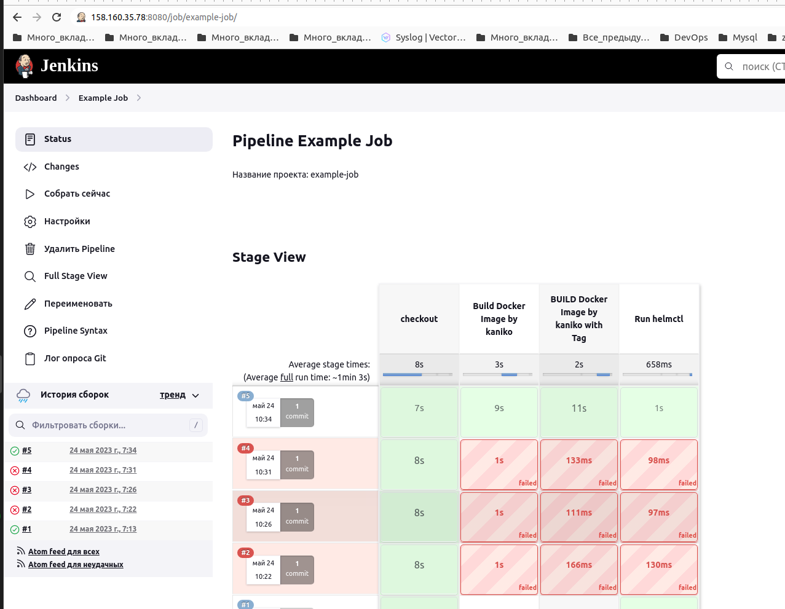


<details>
<summary>Вывод на консоль</summary>

```commandline
Started by an SCM change
Checking out git https://github.com/dmi3x3/app_web.git into /var/lib/jenkins/workspace/example-job@script/979245040ed156c1d70f08ff53b0ee0a6cd1e69733169d8be8a1a569ee38086f to read cicd/pipelines/build.jenkins
The recommended git tool is: NONE
No credentials specified
 > git rev-parse --resolve-git-dir /var/lib/jenkins/workspace/example-job@script/979245040ed156c1d70f08ff53b0ee0a6cd1e69733169d8be8a1a569ee38086f/.git # timeout=10
Fetching changes from the remote Git repository
 > git config remote.origin.url https://github.com/dmi3x3/app_web.git # timeout=10
Fetching upstream changes from https://github.com/dmi3x3/app_web.git
 > git --version # timeout=10
 > git --version # 'git version 2.30.2'
 > git fetch --tags --force --progress -- https://github.com/dmi3x3/app_web.git +refs/heads/*:refs/remotes/origin/* # timeout=10
Seen branch in repository origin/main
Seen 1 remote branch
 > git show-ref --tags -d # timeout=10
Checking out Revision b3055764e155cd7ad25171a35c8ded960274cd47 (origin/main)
 > git config core.sparsecheckout # timeout=10
 > git checkout -f b3055764e155cd7ad25171a35c8ded960274cd47 # timeout=10
Commit message: "fix_149 pipelines build.jenkins file"
 > git rev-list --no-walk ff1aa1a3392a665535e715639c95b3d0f9483f6d # timeout=10
[Pipeline] Start of Pipeline
[Pipeline] podTemplate
[Pipeline] {
[Pipeline] node
Created Pod: kubernetes jenkins/example-job-5-gmvmc-q1skg-ppczw
Agent example-job-5-gmvmc-q1skg-ppczw is provisioned from template example-job_5-gmvmc-q1skg
---
apiVersion: "v1"
kind: "Pod"
metadata:
  annotations:
    buildUrl: "http://jenkins-operator-http-j-instance.jenkins.svc.cluster.local:8080/job/example-job/5/"
    runUrl: "job/example-job/5/"
  labels:
    job: "build-service"
    jenkins: "slave"
    jenkins/label-digest: "5606c9ee6ab88e384e7b32739b94cbcba47ce24b"
    jenkins/label: "example-job_5-gmvmc"
  name: "example-job-5-gmvmc-q1skg-ppczw"
  namespace: "jenkins"
spec:
  containers:
  - command:
    - "cat"
    image: "gcr.io/kaniko-project/executor:debug"
    name: "kaniko"
    tty: true
    volumeMounts:
    - mountPath: "/kaniko/.docker/"
      name: "docker-config"
    - mountPath: "/home/jenkins/agent"
      name: "workspace-volume"
      readOnly: false
  - command:
    - "cat"
    image: "dmi3x3/helmctl:1.0.0"
    name: "helmctl"
    tty: true
    volumeMounts:
    - mountPath: "/home/jenkins/agent"
      name: "workspace-volume"
      readOnly: false
  - env:
    - name: "JENKINS_SECRET"
      value: "********"
    - name: "JENKINS_TUNNEL"
      value: "jenkins-operator-slave-j-instance.jenkins.svc.cluster.local:50000"
    - name: "JENKINS_AGENT_NAME"
      value: "example-job-5-gmvmc-q1skg-ppczw"
    - name: "JENKINS_NAME"
      value: "example-job-5-gmvmc-q1skg-ppczw"
    - name: "JENKINS_AGENT_WORKDIR"
      value: "/home/jenkins/agent"
    - name: "JENKINS_URL"
      value: "http://jenkins-operator-http-j-instance.jenkins.svc.cluster.local:8080/"
    image: "jenkins/inbound-agent:3107.v665000b_51092-5"
    name: "jnlp"
    resources:
      requests:
        memory: "256Mi"
        cpu: "100m"
    volumeMounts:
    - mountPath: "/home/jenkins/agent"
      name: "workspace-volume"
      readOnly: false
  nodeSelector:
    kubernetes.io/os: "linux"
  restartPolicy: "Never"
  serviceAccountName: "deploy-stage1"
  volumes:
  - hostPath:
      path: "/var/run/docker.sock"
    name: "docker-sock"
  - name: "docker-config"
    secret:
      items:
      - key: ".dockerconfigjson"
        path: "config.json"
      secretName: "dockercred"
  - emptyDir:
      medium: ""
    name: "workspace-volume"

Running on example-job-5-gmvmc-q1skg-ppczw in /home/jenkins/agent/workspace/example-job
[Pipeline] {
[Pipeline] withEnv
[Pipeline] {
[Pipeline] timestamps
[Pipeline] {
[Pipeline] stage
[Pipeline] { (checkout)
[Pipeline] script
[Pipeline] {
[Pipeline] checkout
10:34:22  The recommended git tool is: NONE
10:34:25  No credentials specified
10:34:25  Cloning the remote Git repository
10:34:25  Cloning repository https://github.com/dmi3x3/app_web.git
10:34:25   > git init /home/jenkins/agent/workspace/example-job # timeout=10
10:34:25  Fetching upstream changes from https://github.com/dmi3x3/app_web.git
10:34:25   > git --version # timeout=10
10:34:25   > git --version # 'git version 2.30.2'
10:34:25   > git fetch --tags --force --progress -- https://github.com/dmi3x3/app_web.git +refs/heads/*:refs/remotes/origin/* # timeout=10
10:34:26   > git config remote.origin.url https://github.com/dmi3x3/app_web.git # timeout=10
10:34:26   > git config --add remote.origin.fetch +refs/heads/*:refs/remotes/origin/* # timeout=10
10:34:27  Avoid second fetch
10:34:27  Checking out Revision b3055764e155cd7ad25171a35c8ded960274cd47 (origin/main)
10:34:28  Commit message: "fix_149 pipelines build.jenkins file"
[Pipeline] sh
10:34:27  Seen branch in repository origin/main
10:34:27  Seen 1 remote branch
10:34:27   > git show-ref --tags -d # timeout=10
10:34:28   > git config core.sparsecheckout # timeout=10
10:34:28   > git checkout -f b3055764e155cd7ad25171a35c8ded960274cd47 # timeout=10
10:34:28  + git log -1 --format=%h.%ad --date=format:%Y%m%d-%H%M
10:34:28  + cat
[Pipeline] sh
10:34:29  + git --no-pager tag --points-at HEAD
[Pipeline] echo
10:34:29  checking version tag v1.0.149
[Pipeline] echo
10:34:29  tag not null
[Pipeline] sh
10:34:29  + git --no-pager tag --points-at HEAD
[Pipeline] sh
10:34:30  + echo Building revision: 5-b305576.20230524-1033 build_tag: v1.0.149 gt: true
10:34:30  Building revision: 5-b305576.20230524-1033 build_tag: v1.0.149 gt: true
[Pipeline] }
[Pipeline] // script
[Pipeline] }
[Pipeline] // stage
[Pipeline] stage
[Pipeline] { (Build Docker Image by kaniko)
[Pipeline] container
[Pipeline] {
[Pipeline] sh
10:34:31  + pwd
10:34:31  + /kaniko/executor --dockerfile Dockerfile --context /home/jenkins/agent/workspace/example-job/ --verbosity debug --insecure --skip-tls-verify --destination dmi3x3/app_web:5-b305576.20230524-1033
10:34:31  DEBU[0000] Copying file /home/jenkins/agent/workspace/example-job/Dockerfile to /kaniko/Dockerfile 
10:34:32  DEBU[0001] Skip resolving path /kaniko/Dockerfile       
10:34:32  DEBU[0001] Skip resolving path /home/jenkins/agent/workspace/example-job/ 
10:34:32  DEBU[0001] Skip resolving path /cache                   
10:34:32  DEBU[0001] Skip resolving path                          
10:34:32  DEBU[0001] Skip resolving path                          
10:34:32  DEBU[0001] Skip resolving path                          
10:34:32  DEBU[0001] Skip resolving path                          
10:34:32  DEBU[0001] Built stage name to index map: map[]         
10:34:32  INFO[0001] Retrieving image manifest nginx:1.23.3       
10:34:32  INFO[0001] Retrieving image nginx:1.23.3 from registry index.docker.io 
10:34:33  INFO[0002] Built cross stage deps: map[]                
10:34:33  INFO[0002] Retrieving image manifest nginx:1.23.3       
10:34:33  INFO[0002] Returning cached image manifest              
10:34:33  INFO[0002] Executing 0 build triggers                   
10:34:33  INFO[0002] Building stage 'nginx:1.23.3' [idx: '0', base-idx: '-1'] 
10:34:33  INFO[0002] Unpacking rootfs as cmd ADD conf /etc/nginx requires it. 
10:34:33  DEBU[0002] Ignore list: [{/kaniko false} {/etc/mtab false} {/tmp/apt-key-gpghome true} {/var/run false} {/proc false} {/dev false} {/dev/pts false} {/dev/mqueue false} {/sys false} {/sys/fs/cgroup false} {/sys/fs/cgroup/systemd false} {/sys/fs/cgroup/net_cls,net_prio false} {/sys/fs/cgroup/cpu,cpuacct false} {/sys/fs/cgroup/rdma false} {/sys/fs/cgroup/freezer false} {/sys/fs/cgroup/blkio false} {/sys/fs/cgroup/memory false} {/sys/fs/cgroup/pids false} {/sys/fs/cgroup/cpuset false} {/sys/fs/cgroup/devices false} {/sys/fs/cgroup/perf_event false} {/sys/fs/cgroup/hugetlb false} {/busybox false} {/kaniko/.docker false} {/etc/hosts false} {/dev/termination-log false} {/etc/hostname false} {/etc/resolv.conf false} {/dev/shm false} {/home/jenkins/agent false} {/var/run/secrets/kubernetes.io/serviceaccount false} {/dev/console false} {/proc/bus false} {/proc/fs false} {/proc/irq false} {/proc/sys false} {/proc/sysrq-trigger false} {/proc/acpi false} {/proc/kcore false} {/proc/keys false} {/proc/timer_list false} {/proc/sched_debug false} {/proc/scsi false} {/sys/firmware false}] 
10:34:33  DEBU[0002] Not adding /dev because it is ignored        
10:34:33  DEBU[0002] Not adding /etc/hostname because it is ignored 
10:34:33  DEBU[0002] Not adding /etc/resolv.conf because it is ignored 
10:34:33  DEBU[0002] Not adding /proc because it is ignored       
10:34:33  DEBU[0002] Not adding /sys because it is ignored        
10:34:35  DEBU[0004] Not adding /var/run because it is ignored    
10:34:37  DEBU[0006] Resolved conf to conf                        
10:34:37  DEBU[0006] Resolved /etc/nginx to /etc/nginx            
10:34:37  INFO[0006] Using files from context: [/home/jenkins/agent/workspace/example-job/conf] 
10:34:37  INFO[0006] ADD conf /etc/nginx                          
10:34:37  DEBU[0006] Resolved conf to conf                        
10:34:37  DEBU[0006] Resolved /etc/nginx to /etc/nginx            
10:34:37  DEBU[0006] found uid -1 and gid -1 for chown string     
10:34:37  DEBU[0006] Resolved conf to conf                        
10:34:37  DEBU[0006] Resolved /etc/nginx to /etc/nginx            
10:34:37  DEBU[0006] Getting files and contents at root /home/jenkins/agent/workspace/example-job/conf/ for /home/jenkins/agent/workspace/example-job/conf 
10:34:37  DEBU[0006] Copying file /home/jenkins/agent/workspace/example-job/conf/nginx.conf to /etc/nginx/nginx.conf 
10:34:37  DEBU[0006] file at /etc/nginx/nginx.conf already exists, resetting file ownership to root 
10:34:37  INFO[0006] Taking snapshot of files...                  
10:34:37  DEBU[0006] Adding to layer: [/ /etc /etc/nginx /etc/nginx/nginx.conf] 
10:34:37  DEBU[0006] Resolved content to content                  
10:34:37  DEBU[0006] Resolved /usr/share/nginx/html to /usr/share/nginx/html 
10:34:37  INFO[0006] Using files from context: [/home/jenkins/agent/workspace/example-job/content] 
10:34:37  INFO[0006] ADD content /usr/share/nginx/html            
10:34:37  DEBU[0006] Resolved content to content                  
10:34:37  DEBU[0006] Resolved /usr/share/nginx/html to /usr/share/nginx/html 
10:34:37  DEBU[0006] found uid -1 and gid -1 for chown string     
10:34:37  DEBU[0006] Resolved content to content                  
10:34:37  DEBU[0006] Resolved /usr/share/nginx/html to /usr/share/nginx/html 
10:34:37  DEBU[0006] Getting files and contents at root /home/jenkins/agent/workspace/example-job/content/ for /home/jenkins/agent/workspace/example-job/content 
10:34:37  DEBU[0006] Copying file /home/jenkins/agent/workspace/example-job/content/index.html to /usr/share/nginx/html/index.html 
10:34:37  DEBU[0006] file at /usr/share/nginx/html/index.html already exists, resetting file ownership to root 
10:34:37  INFO[0006] Taking snapshot of files...                  
10:34:37  DEBU[0006] Adding to layer: [/ /usr /usr/share /usr/share/nginx /usr/share/nginx/html /usr/share/nginx/html/index.html] 
10:34:37  INFO[0006] EXPOSE 80                                    
10:34:37  INFO[0006] Cmd: EXPOSE                                  
10:34:37  INFO[0006] Adding exposed port: 80/tcp                  
10:34:37  DEBU[0006] Build: skipping snapshot for [EXPOSE 80]     
10:34:37  DEBU[0006] Mapping stage idx 0 to digest sha256:c28ff8da39d6d5025fc5134ad46d3c10ce00d64fc3f521eda756e48a0cea51af 
10:34:37  DEBU[0006] Mapping digest sha256:c28ff8da39d6d5025fc5134ad46d3c10ce00d64fc3f521eda756e48a0cea51af to cachekey  
10:34:37  INFO[0006] Pushing image to dmi3x3/app_web:5-b305576.20230524-1033 
10:34:40  INFO[0008] Pushed index.docker.io/dmi3x3/app_web@sha256:209aab0e0bb81d8cb27a76c2361a3ce97f5591b420c1ba589ebcbae75481ba9b 
[Pipeline] }
[Pipeline] // container
[Pipeline] }
[Pipeline] // stage
[Pipeline] stage
[Pipeline] { (BUILD Docker Image by kaniko with Tag)
[Pipeline] sh
10:34:40  + git --no-pager tag --points-at HEAD
[Pipeline] echo
10:34:40  checking version tag v1.0.149
[Pipeline] echo
10:34:40  tag not null
[Pipeline] container
[Pipeline] {
[Pipeline] sh
10:34:41  + pwd
10:34:41  + /kaniko/executor --dockerfile Dockerfile --context /home/jenkins/agent/workspace/example-job/ --verbosity debug --insecure --skip-tls-verify --destination dmi3x3/app_web:v1.0.149 --destination dmi3x3/app_web:latest
10:34:41  DEBU[0000] Copying file /home/jenkins/agent/workspace/example-job/Dockerfile to /kaniko/Dockerfile 
10:34:41  DEBU[0000] file at /kaniko/Dockerfile already exists, resetting file ownership to root 
10:34:42  DEBU[0000] Skip resolving path /kaniko/Dockerfile       
10:34:42  DEBU[0000] Skip resolving path /home/jenkins/agent/workspace/example-job/ 
10:34:42  DEBU[0000] Skip resolving path /cache                   
10:34:42  DEBU[0000] Skip resolving path                          
10:34:42  DEBU[0000] Skip resolving path                          
10:34:42  DEBU[0000] Skip resolving path                          
10:34:42  DEBU[0000] Skip resolving path                          
10:34:42  DEBU[0000] Built stage name to index map: map[]         
10:34:42  INFO[0000] Retrieving image manifest nginx:1.23.3       
10:34:42  INFO[0000] Retrieving image nginx:1.23.3 from registry index.docker.io 
10:34:43  INFO[0002] Built cross stage deps: map[]                
10:34:43  INFO[0002] Retrieving image manifest nginx:1.23.3       
10:34:43  INFO[0002] Returning cached image manifest              
10:34:43  INFO[0002] Executing 0 build triggers                   
10:34:43  INFO[0002] Building stage 'nginx:1.23.3' [idx: '0', base-idx: '-1'] 
10:34:43  INFO[0002] Unpacking rootfs as cmd ADD conf /etc/nginx requires it. 
10:34:43  DEBU[0002] Ignore list: [{/kaniko false} {/etc/mtab false} {/tmp/apt-key-gpghome true} {/var/run false} {/proc false} {/dev false} {/dev/pts false} {/dev/mqueue false} {/sys false} {/sys/fs/cgroup false} {/sys/fs/cgroup/systemd false} {/sys/fs/cgroup/net_cls,net_prio false} {/sys/fs/cgroup/cpu,cpuacct false} {/sys/fs/cgroup/rdma false} {/sys/fs/cgroup/freezer false} {/sys/fs/cgroup/blkio false} {/sys/fs/cgroup/memory false} {/sys/fs/cgroup/pids false} {/sys/fs/cgroup/cpuset false} {/sys/fs/cgroup/devices false} {/sys/fs/cgroup/perf_event false} {/sys/fs/cgroup/hugetlb false} {/busybox false} {/kaniko/.docker false} {/etc/hosts false} {/dev/termination-log false} {/etc/hostname false} {/etc/resolv.conf false} {/dev/shm false} {/home/jenkins/agent false} {/var/run/secrets/kubernetes.io/serviceaccount false} {/dev/console false} {/proc/bus false} {/proc/fs false} {/proc/irq false} {/proc/sys false} {/proc/sysrq-trigger false} {/proc/acpi false} {/proc/kcore false} {/proc/keys false} {/proc/timer_list false} {/proc/sched_debug false} {/proc/scsi false} {/sys/firmware false}] 
10:34:43  DEBU[0002] Not adding /dev because it is ignored        
10:34:43  DEBU[0002] Not adding /etc/hostname because it is ignored 
10:34:43  DEBU[0002] Not adding /etc/resolv.conf because it is ignored 
10:34:43  DEBU[0002] Not adding /proc because it is ignored       
10:34:43  DEBU[0002] Not adding /sys because it is ignored        
10:34:44  DEBU[0003] Not adding /var/run because it is ignored    
10:34:46  DEBU[0005] Resolved conf to conf                        
10:34:46  DEBU[0005] Resolved /etc/nginx to /etc/nginx            
10:34:46  INFO[0005] Using files from context: [/home/jenkins/agent/workspace/example-job/conf] 
10:34:46  INFO[0005] ADD conf /etc/nginx                          
10:34:46  DEBU[0005] Resolved conf to conf                        
10:34:46  DEBU[0005] Resolved /etc/nginx to /etc/nginx            
10:34:46  DEBU[0005] found uid -1 and gid -1 for chown string     
10:34:46  DEBU[0005] Resolved conf to conf                        
10:34:46  DEBU[0005] Resolved /etc/nginx to /etc/nginx            
10:34:46  DEBU[0005] Getting files and contents at root /home/jenkins/agent/workspace/example-job/conf/ for /home/jenkins/agent/workspace/example-job/conf 
10:34:46  DEBU[0005] Copying file /home/jenkins/agent/workspace/example-job/conf/nginx.conf to /etc/nginx/nginx.conf 
10:34:46  DEBU[0005] file at /etc/nginx/nginx.conf already exists, resetting file ownership to root 
10:34:46  INFO[0005] Taking snapshot of files...                  
10:34:46  DEBU[0005] Adding to layer: [/ /etc /etc/nginx /etc/nginx/nginx.conf] 
10:34:46  DEBU[0005] Resolved content to content                  
10:34:46  DEBU[0005] Resolved /usr/share/nginx/html to /usr/share/nginx/html 
10:34:46  INFO[0005] Using files from context: [/home/jenkins/agent/workspace/example-job/content] 
10:34:46  INFO[0005] ADD content /usr/share/nginx/html            
10:34:46  DEBU[0005] Resolved content to content                  
10:34:46  DEBU[0005] Resolved /usr/share/nginx/html to /usr/share/nginx/html 
10:34:46  DEBU[0005] found uid -1 and gid -1 for chown string     
10:34:46  DEBU[0005] Resolved content to content                  
10:34:46  DEBU[0005] Resolved /usr/share/nginx/html to /usr/share/nginx/html 
10:34:46  DEBU[0005] Getting files and contents at root /home/jenkins/agent/workspace/example-job/content/ for /home/jenkins/agent/workspace/example-job/content 
10:34:46  DEBU[0005] Copying file /home/jenkins/agent/workspace/example-job/content/index.html to /usr/share/nginx/html/index.html 
10:34:46  DEBU[0005] file at /usr/share/nginx/html/index.html already exists, resetting file ownership to root 
10:34:46  INFO[0005] Taking snapshot of files...                  
10:34:46  DEBU[0005] Adding to layer: [/ /usr /usr/share /usr/share/nginx /usr/share/nginx/html /usr/share/nginx/html/index.html] 
10:34:46  INFO[0005] EXPOSE 80                                    
10:34:46  INFO[0005] Cmd: EXPOSE                                  
10:34:46  INFO[0005] Adding exposed port: 80/tcp                  
10:34:46  DEBU[0005] Build: skipping snapshot for [EXPOSE 80]     
10:34:46  DEBU[0005] Mapping stage idx 0 to digest sha256:9adbec1f71e70e9708cca802256d6825641a0fb75051e94aa0cdfa3cf6e2d990 
10:34:46  DEBU[0005] Mapping digest sha256:9adbec1f71e70e9708cca802256d6825641a0fb75051e94aa0cdfa3cf6e2d990 to cachekey  
10:34:46  INFO[0005] Pushing image to dmi3x3/app_web:v1.0.149     
10:34:49  INFO[0007] Pushed index.docker.io/dmi3x3/app_web@sha256:1dc8d2011e55ee3bf730d5ec903d53cf4c64be7540ab0f56dcc851e4a2446771 
10:34:49  INFO[0007] Pushing image to dmi3x3/app_web:latest       
10:34:51  INFO[0009] Pushed index.docker.io/dmi3x3/app_web@sha256:1dc8d2011e55ee3bf730d5ec903d53cf4c64be7540ab0f56dcc851e4a2446771 
[Pipeline] }
[Pipeline] // container
[Pipeline] }
[Pipeline] // stage
[Pipeline] stage
[Pipeline] { (Run helmctl)
[Pipeline] container
[Pipeline] {
[Pipeline] sh
10:34:52  + helm upgrade app-web-repo app-web-chart --set 'image_frontend.tag=v1.0.149' --install -n stage
10:34:52  Release "app-web-repo" has been upgraded. Happy Helming!
10:34:52  NAME: app-web-repo
10:34:52  LAST DEPLOYED: Wed May 24 07:34:52 2023
10:34:52  NAMESPACE: stage
10:34:52  STATUS: deployed
10:34:52  REVISION: 3
10:34:52  TEST SUITE: None
10:34:52  NOTES:
10:34:52  ---------------------------------------------------------
10:34:52  
10:34:52  Content of NOTES.txt appears after deploy.
10:34:52  Deployed version v1.0.149.
10:34:52  
10:34:52  ---------------------------------------------------------
10:34:52  + kubectl get pods -n stage
10:34:52  NAME                                    READY   STATUS              RESTARTS   AGE
10:34:52  app-web-app-web-repo-6f95967898-zpl5f   1/1     Running             0          20h
10:34:52  app-web-app-web-repo-849c6ccbc6-fjj47   0/1     ContainerCreating   0          0s
[Pipeline] }
[Pipeline] // container
[Pipeline] }
[Pipeline] // stage
[Pipeline] }
[Pipeline] // timestamps
[Pipeline] }
[Pipeline] // withEnv
[Pipeline] }
[Pipeline] // node
[Pipeline] }
[Pipeline] // podTemplate
[Pipeline] End of Pipeline
Finished: SUCCESS
```

</details>

---
## Что необходимо для сдачи задания?

1. Репозиторий с конфигурационными файлами Terraform и готовность продемонстрировать создание всех ресурсов с нуля.

   Результат: [Репозиторий с конфигурационными файлами Terraform](https://github.com/dmi3x3/netology_diplom)
2. Пример pull request с комментариями созданными atlantis'ом.
   
   Результат: [pull request](https://github.com/dmi3x3/netology_diplom/pull/3)
3. Репозиторий с конфигурацией ansible, если был выбран способ создания Kubernetes кластера при помощи ansible.
   
   Результат: [kubespray](https://github.com/kubernetes-sigs/kubespray)

   Результат: [inventory.tf](https://raw.githubusercontent.com/dmi3x3/netology_diplom/main/inventory.tf)

   Результат: [inventory.tmpl](https://raw.githubusercontent.com/dmi3x3/netology_diplom/main/inventory.tmpl)

   Результат: [example_stage-inventory](https://raw.githubusercontent.com/dmi3x3/netology_diplom/main/example_stage-inventory)
4. Репозиторий с Dockerfile тестового приложения и ссылка на собранный docker image.
   
   Результат: [Dockerfile](https://raw.githubusercontent.com/dmi3x3/app_web/main/Dockerfile)

   Результат: [docker image](https://hub.docker.com/layers/dmi3x3/app_web/v1.0.149/images/sha256-1dc8d2011e55ee3bf730d5ec903d53cf4c64be7540ab0f56dcc851e4a2446771?context=explore)
    ```commandline
    docker pull dmi3x3/app_web:v1.0.149
    ```
5. Репозиторий с конфигурацией Kubernetes кластера.

   Результат: [ansible.tf](https://raw.githubusercontent.com/dmi3x3/netology_diplom/main/ansible.tf)

   Результат: [atlantis.tf](https://raw.githubusercontent.com/dmi3x3/netology_diplom/main/atlantis.tf)
6. Ссылка на тестовое приложение и веб интерфейс Grafana с данными доступа.
   
   Результат: [тестовое приложение](http://158.160.35.78/)
   
   Результат: [веб интерфейс Grafana](http://158.160.35.78:3000/login) (admin/admin)
7. Все репозитории рекомендуется хранить на одном ресурсе (github, gitlab)

    Результат: [github.com/dmi3x3](https://github.com/dmi3x3)
---
При при 
Чтобы приложение было "production" версии, jenkins при отправке в реестр образа с тегом, отправляет его же с тегом latest.
Получается, при создании kubernetes кластера из terraform тестовое приложение деплоится в кубер с тегом latest (на момент создания кубера это последняя "production" версия приложения), все последующие версии приложения деплоит jenkins. 
---

## Процесс запуска проекта:

1. Склонировать kubespray:

```commandline
git clone https://github.com/kubernetes-sigs/kubespray.git
```
2. Склонировать проект:
```commandline
git clone https://github.com/dmi3x3/netology_diplom.git
```
3. Переместиться в проект:
```commandline
cd netology_diplom
```
4. Склонировать проект:
```commandline
git clone https://github.com/dmi3x3/app_web.git
```
5. Обеспечить наличие в этом каталоге файлов auto.tfvars, key.json - для их создания можно использовать сэмплы.
6. Проверить наличие в $HOME/.ssh/ ключа id_ed25519_atlant или прописать в проекте свой в atlantis.tf
7. Для создания s3-backet выполнить terraform init/plan/apply в каталоге S3.
```commandline
cd S3
terraform init
terraform plan
terraform apply -auto-approve
```
7. Полученные реквизиты bucket внести в provider.tf
8. Выполнить terraform init/plan/apply
```commandline
cd ../
terraform init
terraform plan
terraform apply -auto-approve
```
9. Дождаться Применения всех terraform манифестов и вывода команды terraform output, для получения логина/пароля от jenkins в консоли выполнить
```commandline
echo -e "`kubectl get -n jenkins secret jenkins-operator-credentials-j-instance -o 'jsonpath={.data.user}' | base64 -d`\n`kubectl get -n jenkins secret jenkins-operator-credentials-j-instance -o 'jsonpath={.data.password}' | base64 -d`"
```

---
## Некоторые проблемы возникшие при подготовке дипломной работы.

### Terraform
При подготовке манифестов использовал одно из домашних заданий, доработав его под себя. Первоначально команды terraform plan, terraform apply отрабатывали штатно, без проблем, но при запуске этих команд в запущенной инфраструктуре, план сообщал, что пересоздаст все ноды, а apply перезапускал их.

Налицо неправильное поведение. Поиск причины такого поведения привел к параметру type = "network-nvme" 
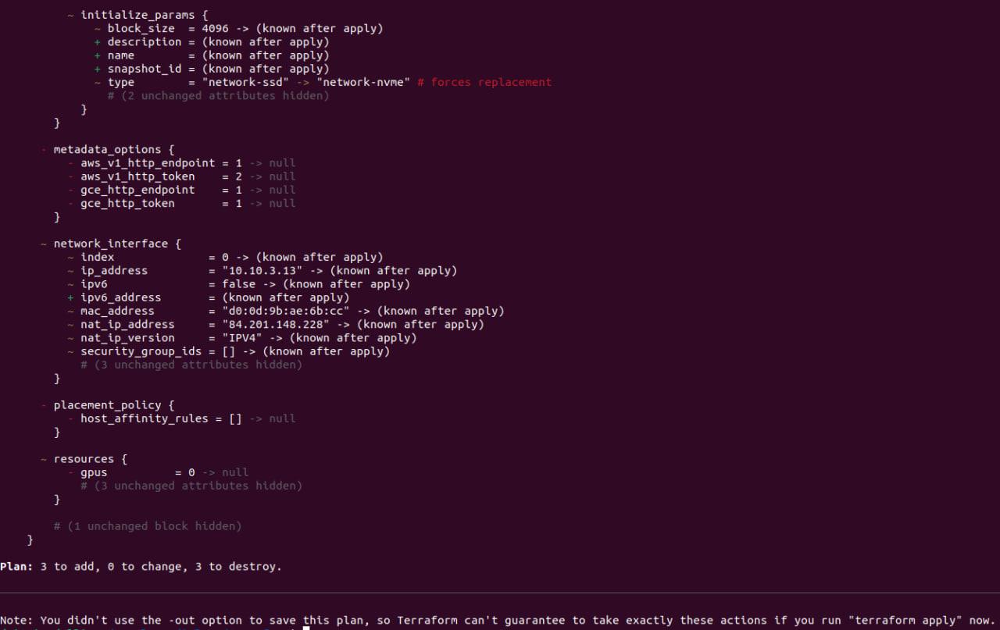
провайдер терраформ yandex создавал ВМ с этим параметром, но с каждым plan/apply пытался изменить его.
после смены этого параметра на type = "network-ssd", терраформ стал работать штатно, ожидаемо.
ТП Яндекс.Облако сообщила, что данный параметр оставлен для обратной совместимости, хотя не ясно, как постоянное пересоздание запущенных ВМ поможет совместимости? Обещали сообщить разработчикам.

### Jenkins

Для ci/cd использовал Jenkins Operator, нативный кубернетес-оператор. Это позволило поместить всю конфигурацию jenkins в проект с [тестовым приложением](https://github.com/dmi3x3/app_web/tree/main/cicd). Проблема была с несоответствием манифеста CRD и docker-образа оператора, заменил версию образа:
```commandline
image: virtuslab/jenkins-operator:v0.7.1 => image: virtuslab/jenkins-operator:60b8ee5
```

также потребовалось указать версии некоторых основных плагинов, т.к. с версиями плагинов по-умолчанию под не стартует, идет циклический перезапуск.

И для надежности вместо контейнера с docker для создания docker образов, использовал kaniko, у которого нет проблем с запуском в кубернетес.

---
## Как правильно задавать вопросы дипломному руководителю?

Что поможет решить большинство частых проблем:

1. Попробовать найти ответ сначала самостоятельно в интернете или в 
  материалах курса и ДЗ и только после этого спрашивать у дипломного 
  руководителя. Навык поиска ответов пригодится вам в профессиональной 
  деятельности.
2. Если вопросов больше одного, присылайте их в виде нумерованного 
  списка. Так дипломному руководителю будет проще отвечать на каждый из 
  них.
3. При необходимости прикрепите к вопросу скриншоты и стрелочкой 
  покажите, где не получается.

Что может стать источником проблем:

1. Вопросы вида «Ничего не работает. Не запускается. Всё сломалось». 
  Дипломный руководитель не сможет ответить на такой вопрос без 
  дополнительных уточнений. Цените своё время и время других.
2. Откладывание выполнения курсового проекта на последний момент.
3. Ожидание моментального ответа на свой вопрос. Дипломные руководители - практикующие специалисты, которые занимаются, кроме преподавания, 
  своими проектами. Их время ограничено, поэтому постарайтесь задавать правильные вопросы, чтобы получать быстрые ответы :)
